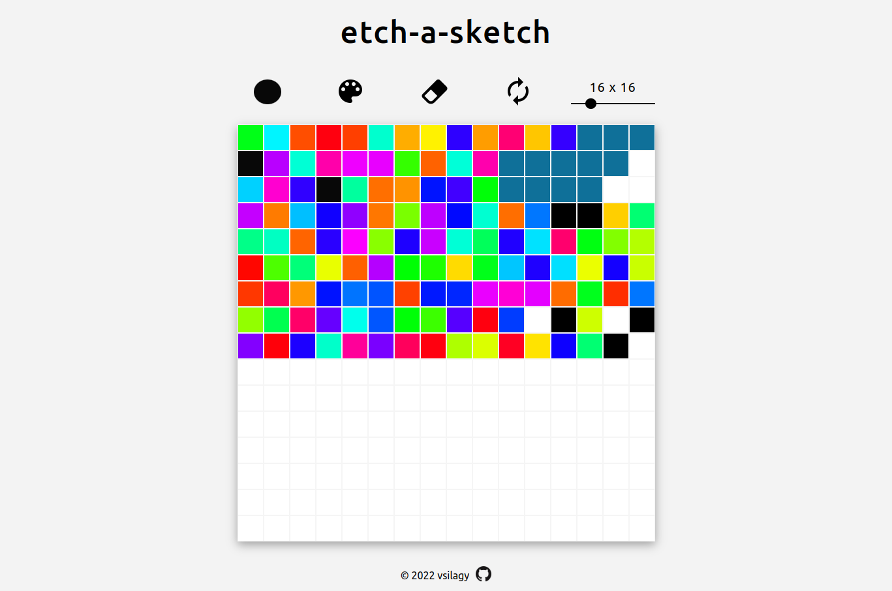

# Etch-A-Sketch

[Live Preview](https://vsilagy.github.io/etch-a-sketch)

### **The Odin Project** : [Etch-A-Sketch](https://www.theodinproject.com/paths/foundations/courses/foundations/lessons/etch-a-sketch-project)

### Objectives:

- Build a sketchpad using DOM manipulation
- _Added color picker using this [tutorial](https://youtu.be/9Ds6dzhda0c)_
- _Updated the grid range slide using this [tutorial](https://youtu.be/ReRny33Yzbw)_
