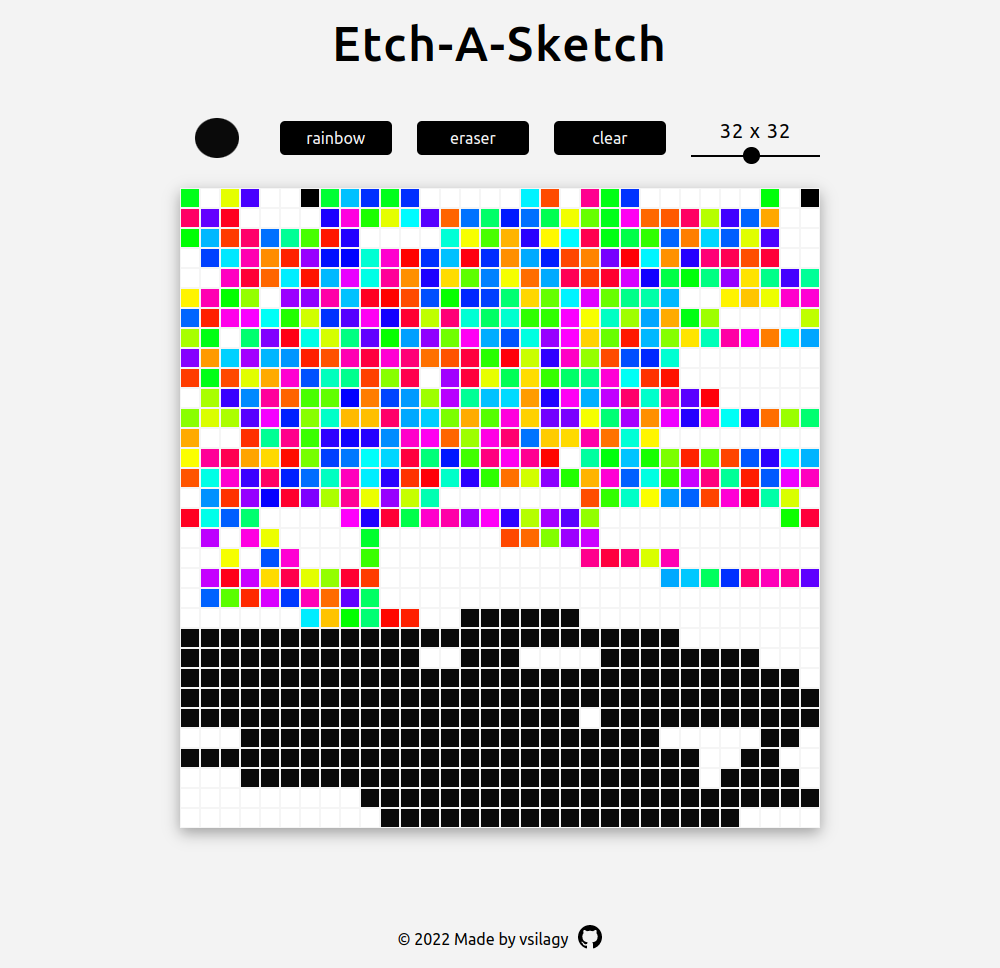

# Etch-A-Sketch

A simple Etch-A-Sketch board with color picker, random color, eraser , clear board and adjustable grid size buttons.

[Live Preview](https://vsilagy.github.io/etch-a-sketch)

## Built with:

- HTML
- CSS
- JavaScript

### **The Odin Project**: [Etch-A-Sketch](https://www.theodinproject.com/paths/foundations/courses/foundations/lessons/etch-a-sketch-project)

#### Objectives:

- Build a sketchpad board using DOM manipulation
- _Added color picker using this [tutorial](https://youtu.be/9Ds6dzhda0c)_
- _Updated the grid range slide using this [tutorial](https://youtu.be/ReRny33Yzbw)_
